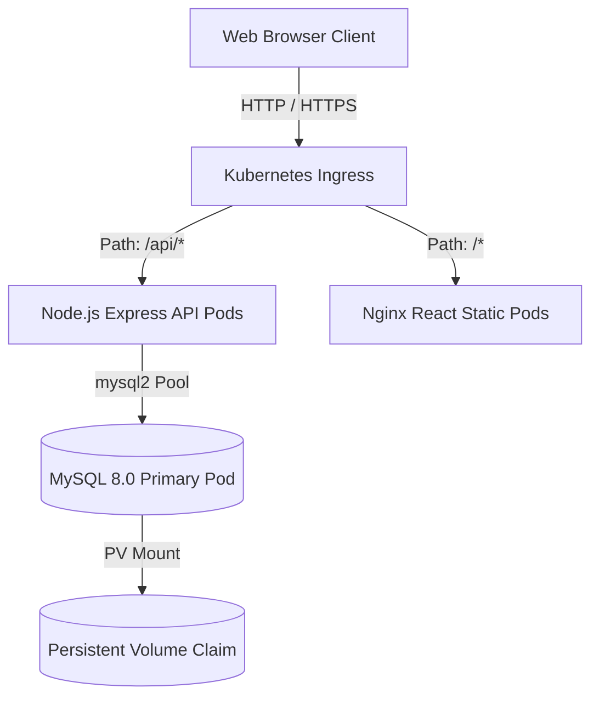

# Enterprise Inventory Management System (IMS)

This project is the first part of an **Enterprise GitOps Kubernetes Portfolio**. It establishes a complete, production-ready **Inventory Management System** designed for high-availability cloud environments and compatible with GitOps using **Argo CD** on **Kubernetes**.

---

## Architecture Overview

The system follows a clean, decoupled MVC architecture consisting of:
- **Client Frontend**: React single-page application built on Vite and served via an Nginx Alpine container.
- **REST API Backend**: Node.js and Express app managing authentication-free MVC operations, database connection pooling, and inventory transaction auditing.
- **Database Storage**: MySQL 8.0 server instances backed by Kubernetes PersistentVolumeClaims.
- **Kubernetes Ingress**: Nginx ingress controller mapping path routers to backend APIs (`/api/*`) and frontend nodes (`/*`).



---

## Tech Stack

### Frontend
- **Framework**: React 18
- **Build Tool**: Vite
- **Routing**: React Router DOM v6
- **API Client**: Axios
- **Styling**: Modern Custom CSS (Variables-based clean enterprise white theme)

### Backend
- **Platform**: Node.js
- **Framework**: Express.js
- **Database Driver**: MySQL2 (with promise transaction support)
- **Security & Utilities**:
  - `helmet`: Express security header guards
  - `cors`: Cross-Origin Resource Sharing setup
  - `morgan`: HTTP logger middleware
  - `dotenv`: Environment configuration variables loader

### Database
- **Engine**: MySQL 8.0
- **Seeding**: Automatically bootstraps 8 categories, 10 suppliers, 75 product items, and historical activity logs if the tables are empty on startup.

### Containerization & Deployment
- **Packaging**: Multi-stage Docker configurations
- **Orchestration**: Kubernetes manifests (Deployments, ClusterIP Services, PVC, ConfigMaps, Secrets, Ingress)
- **GitOps**: Ready for automated Argo CD sync

---

## Folder Structure

```text
inventory-management-system/
│
├── .github/
│   └── workflows/
│       └── ci-cd.yml             # GitHub Actions CI/CD workflow config
│
├── backend/
│   ├── config/
│   │   └── db.js                 # MySQL Pool Connection configuration
│   ├── controllers/
│   │   ├── categoryController.js  # Category operations
│   │   ├── dashboardController.js # Charts & summary stats calculations
│   │   ├── productController.js   # Product operations & logs trigger
│   │   └── supplierController.js  # Supplier operations
│   ├── database/
│   │   ├── initDb.js             # DB bootstrap engine
│   │   ├── schema.sql            # Table definitions
│   │   └── seed.sql              # Core dataset seeds
│   ├── middleware/
│   │   └── errorHandler.js       # Centralized error mapping
│   ├── models/
│   │   ├── categoryModel.js      # Category SQL queries
│   │   ├── dashboardModel.js     # Aggregate stats query models
│   │   ├── productModel.js       # Products transaction models
│   │   └── supplierModel.js      # Supplier SQL queries
│   ├── routes/                   # Router maps for all modules
│   ├── .env                      # Local env configs
│   ├── package.json              # Backend dependencies
│   └── server.js                 # API server entrypoint
│
├── frontend/
│   ├── public/                   # Public assets
│   ├── src/
│   │   ├── components/
│   │   │   ├── Charts.jsx        # SVG Stock, Category, and Trend Charts
│   │   │   ├── Modal.jsx         # CRUD Form & confirmation modal
│   │   │   ├── Navbar.jsx        # Breadcrumbs & mobile toggle nav
│   │   │   ├── Sidebar.jsx       # Custom inline SVG menu sidebar
│   │   │   ├── Spinner.jsx       # Loading UI spinner
│   │   │   └── Toast.jsx         # Global notifications context
│   │   ├── pages/
│   │   │   ├── Categories.jsx    # Category CRUD View
│   │   │   ├── Dashboard.jsx     # Stats, charts, recent table & log
│   │   │   ├── Products.jsx      # Product CRUD, Search & Filters View
│   │   │   ├── Reports.jsx       # Print-friendly audit reports view
│   │   │   ├── Settings.jsx      # System & GitOps configs form (UI Mock)
│   │   │   └── Suppliers.jsx     # Suppliers CRUD View
│   │   ├── utils/
│   │   │   └── api.js            # Axios utility class
│   │   ├── App.jsx               # App routing shell
│   │   ├── index.css             # Design tokens & layout CSS styles
│   │   └── main.jsx              # Vite root mounting script
│   ├── nginx.conf                # SPA routing fallback nginx server block
│   ├── package.json              # Frontend packages
│   └── vite.config.js            # Vite configuration & proxy settings
│
├── k8s/                          # Production GitOps deployment targets
│   ├── namespace.yaml            # Isolated "inventory-system" NS
│   ├── pvc-db.yaml               # Storage requests for DB
│   ├── deployment-db.yaml        # MySQL Spec (Includes Secrets/ConfigMaps)
│   ├── service-db.yaml           # Database Service (ClusterIP)
│   ├── deployment-backend.yaml   # Express API pods (Docker Hub image)
│   ├── service-backend.yaml      # Backend Service (ClusterIP)
│   ├── deployment-frontend.yaml  # Nginx static client pods (Docker Hub image)
│   ├── service-frontend.yaml     # Frontend Service (ClusterIP)
│   └── ingress.yaml              # Domain path mapping rules
│
├── Dockerfile.backend            # Production backend Docker file (at root)
├── Dockerfile.frontend           # Multi-stage Nginx static Docker file (at root)
├── screenshots/                  # Image assets
└── README.md                     # System documentation
```

---

## API Endpoints

### 1. Dashboard
- `GET /api/dashboard` - Returns summary metrics, low stock warnings, audit feed, and chart structures.

### 2. Products
- `GET /api/products` - List products. Supports search parameters:
  - `?search=<name_or_sku>`
  - `?categoryId=<id>`
  - `?status=<In Stock|Low Stock|Out of Stock>`
- `GET /api/products/:id` - Product details.
- `POST /api/products` - Creates new SKU and writes to audit logs.
- `PUT /api/products/:id` - Updates details and computes quantity stock activity changes.
- `DELETE /api/products/:id` - Deletes product entry.

### 3. Categories
- `GET /api/categories` - Fetch all categories.
- `GET /api/categories/:id` - Details.
- `POST /api/categories` - Create new category.
- `PUT /api/categories/:id` - Edit category name or description.
- `DELETE /api/categories/:id` - Delete category (succeeds only if unused).

### 4. Suppliers
- `GET /api/suppliers` - Fetch all active suppliers.
- `GET /api/suppliers/:id` - Supplier details.
- `POST /api/suppliers` - Add supplier profile.
- `PUT /api/suppliers/:id` - Edit supplier.
- `DELETE /api/suppliers/:id` - Delete supplier profile.

### 5. Health Check
- `GET /api/health` - Performs self-checks on database connectivity. Returns `200` if UP, `500` if DOWN.

---

## Local Setup Instructions

### Prerequisites
- Node.js (v18+)
- MySQL Server 8

### Manual Local Dev Run

1. **Database Setup**:
   Create a database named `inventory_db` in your MySQL console.
   ```sql
   CREATE DATABASE inventory_db;
   ```

2. **Backend Startup**:
   Navigate to backend, create `.env` copy and configure connections, then run npm scripts:
   ```bash
   cd backend
   npm install
   # Edit configuration values inside .env
   npm run dev
   ```
   *Note: On startup, the backend checks for database tables and automatically imports schemas and seed rows.*

3. **Frontend Startup**:
   Navigate to frontend and run the Vite server:
   ```bash
   cd frontend
   npm install
   npm run dev
   ```
   Open `http://localhost:3000` in browser.

---

## Docker Commands

Build and package the containers locally using the Dockerfiles in the project root:

```bash
# Build Backend image (run from project root)
docker build -t ims-backend:latest -f Dockerfile.backend ./backend

# Build Frontend image (run from project root)
docker build -t ims-frontend:latest -f Dockerfile.frontend ./frontend
```

Run containers locally together:
```bash
# Run database container
docker run -d --name ims-db -e MYSQL_DATABASE=inventory_db -e MYSQL_ROOT_PASSWORD=rootpassword -p 3306:3306 mysql:8.0

# Run API backend container (linked to db container)
docker run -d --name ims-backend -p 5000:5000 -e DB_HOST=host.docker.internal -e DB_PASSWORD=rootpassword ims-backend:latest

# Run Nginx Frontend container
docker run -d --name ims-frontend -p 80:80 ims-frontend:latest
```

---

## CI/CD Pipeline

The project features a complete GitOps-driven deployment workflow:

```text
Developer
   ↓
Git Push (to main branch)
   ↓
GitHub Actions
   ├── Authenticates with Docker Hub using secrets
   ├── Builds Docker images from root Dockerfiles (Dockerfile.frontend/Dockerfile.backend)
   ├── Tags images with 'latest' and 'github.sha'
   └── Pushes images to Docker Hub
   ↓
Argo CD (detects repository / manifest changes)
   ↓
Kubernetes Deployment (Kind on EC2 pulls from Docker Hub and updates pods)
```

### 1. Required GitHub Secrets
To allow GitHub Actions to build and push the images, configure the following secrets in your GitHub repository (`Settings` > `Secrets and variables` > `Actions`):
- `DOCKERHUB_USERNAME`: Your Docker Hub username.
- `DOCKERHUB_TOKEN`: A Docker Hub Personal Access Token (PAT) with read/write access.

### 2. Docker Hub Repository Creation
Ensure you have created the following repositories in your Docker Hub account prior to running the workflow:
- `<your-dockerhub-username>/inventory-frontend`
- `<your-dockerhub-username>/inventory-backend`

### 3. GitHub Actions Workflow
The workflow is located at `.github/workflows/ci-cd.yml`. It:
- Triggers automatically on any push to the `main` branch.
- Checks out the repository code.
- Logs into Docker Hub using the configured secrets.
- Builds the frontend and backend Docker images using the respective folder contexts and the root-level Dockerfiles (`Dockerfile.frontend` and `Dockerfile.backend`).
- Tags both images with `latest` and the unique git commit SHA (`${{ github.sha }}`).
- Pushes both images to Docker Hub under the placeholder namespace (which you should customize to your Docker Hub username).

### 4. How Argo CD Fits into the Deployment
Argo CD acts as the GitOps agent running inside the Kubernetes cluster:
- It tracks the Git repository containing the Kubernetes manifests in the `k8s/` folder.
- When an updated manifest or image tag is pushed to Git, Argo CD detects the difference between the desired state in Git and the live state in Kubernetes.
- It pulls the updated manifest configuration and triggers a rolling update in the cluster, which pulls the new images from Docker Hub using the `IfNotPresent` image pull policy.

---

## Kubernetes Deployment Steps (GitOps / Argo CD)

To deploy the stack on Kubernetes using GitOps delivery:

### Step 1: Apply Namespace
Create the namespace isolation boundary first:
```bash
kubectl apply -f k8s/namespace.yaml
```

### Step 2: Push Configurations and Secrets
Wait, in production, encrypt secrets (e.g. using SealedSecrets or HashiCorp Vault). For standard deployment, apply the configmap/secrets definitions embedded in the database deployment:
```bash
kubectl apply -f k8s/pvc-db.yaml
kubectl apply -f k8s/deployment-db.yaml
kubectl apply -f k8s/service-db.yaml
```

### Step 3: Apply Application Deployments
Deploy the replica applications and services:
```bash
kubectl apply -f k8s/deployment-backend.yaml
kubectl apply -f k8s/service-backend.yaml
kubectl apply -f k8s/deployment-frontend.yaml
kubectl apply -f k8s/service-frontend.yaml
```

### Step 4: Apply Traffic Routing
Apply the Ingress manifest to map DNS / HTTP rules:
```bash
kubectl apply -f k8s/ingress.yaml
```

### Argo CD GitOps Application Configuration
To synchronize this project automatically with Argo CD, deploy the following Application resource in your cluster control plane:

```yaml
apiVersion: argoproj.io/v1alpha1
kind: Application
metadata:
  name: enterprise-ims
  namespace: argocd
spec:
  project: default
  source:
    repoURL: 'https://github.com/<your-org>/<your-repo>.git'
    targetRevision: HEAD
    path: k8s
  destination:
    server: 'https://kubernetes.default.svc'
    namespace: inventory-system
  syncPolicy:
    automated:
      prune: true
      selfHeal: true
    syncOptions:
      - CreateNamespace=true
```

---

## Screenshots

Ensure screenshots are placed inside `/screenshots` directory matching the following layout:
- `screenshots/dashboard.png` - Analytics dashboard with SVG donut and bar graphs.
- `screenshots/catalog.png` - Product list showing SKU badges, category filters, and search forms.
- `screenshots/reports.png` - Printable inventory valuation reports.

---

## Future Improvements

1. **Multi-Factor Authentication**: Implement OAuth2 login capabilities with role-based dashboard views.
2. **Predictive Stock Planning**: Integrate historical activity streams to alert managers of forecasted stock depletions.
3. **Advanced Export Formats**: Offer direct downloads of XLSX, PDF, and CSV files in the reports console.
4. **Barcode Scanning**: Leverage mobile browser cameras to scan and automatically search SKUs in the catalog.
