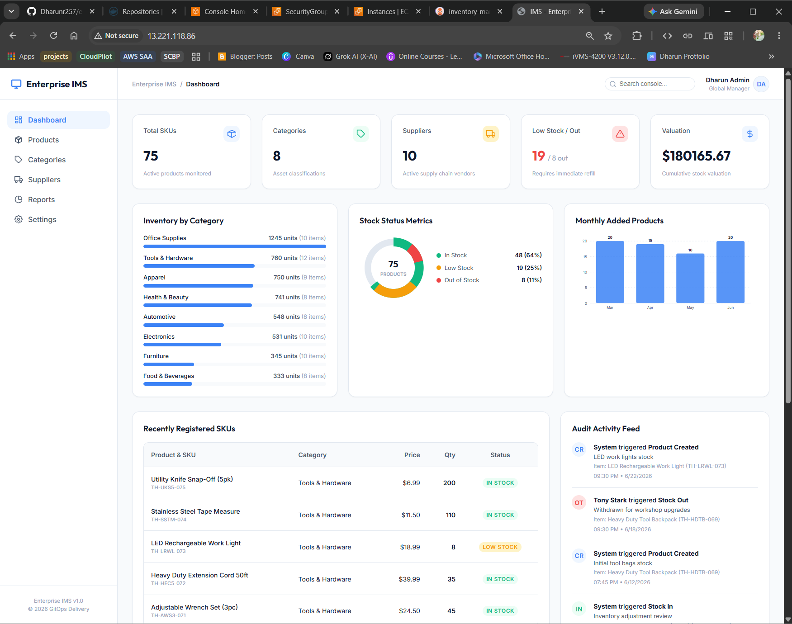
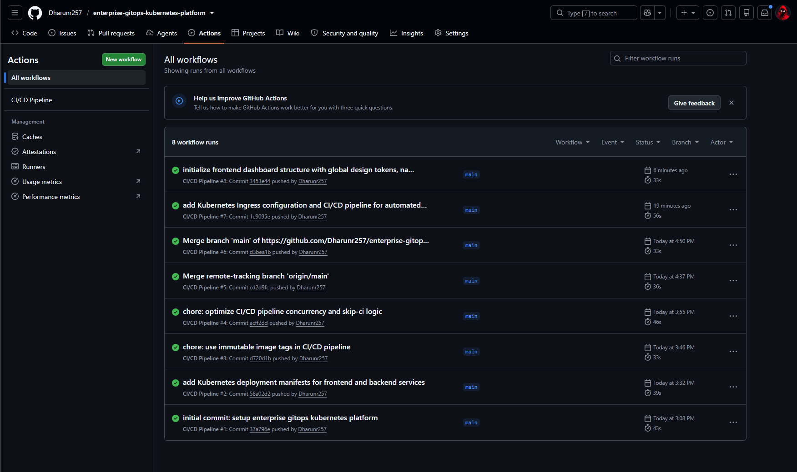
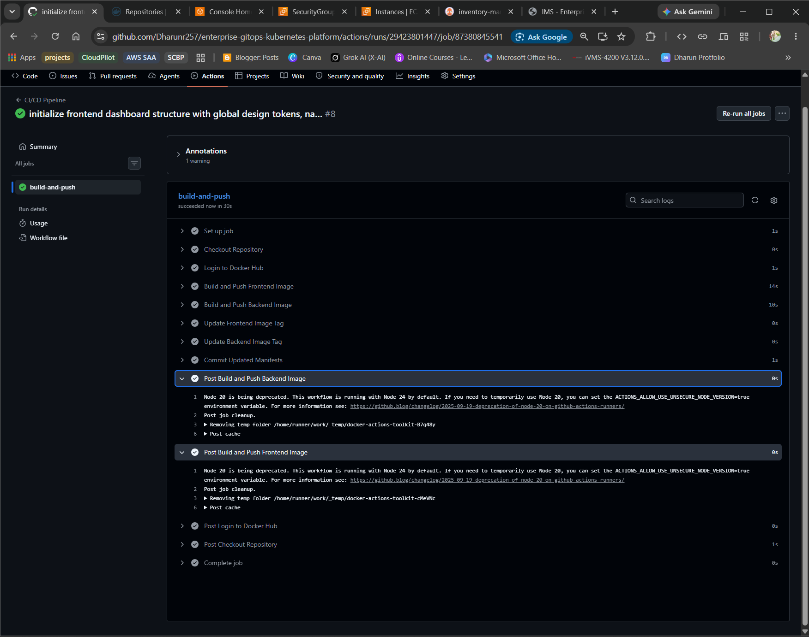
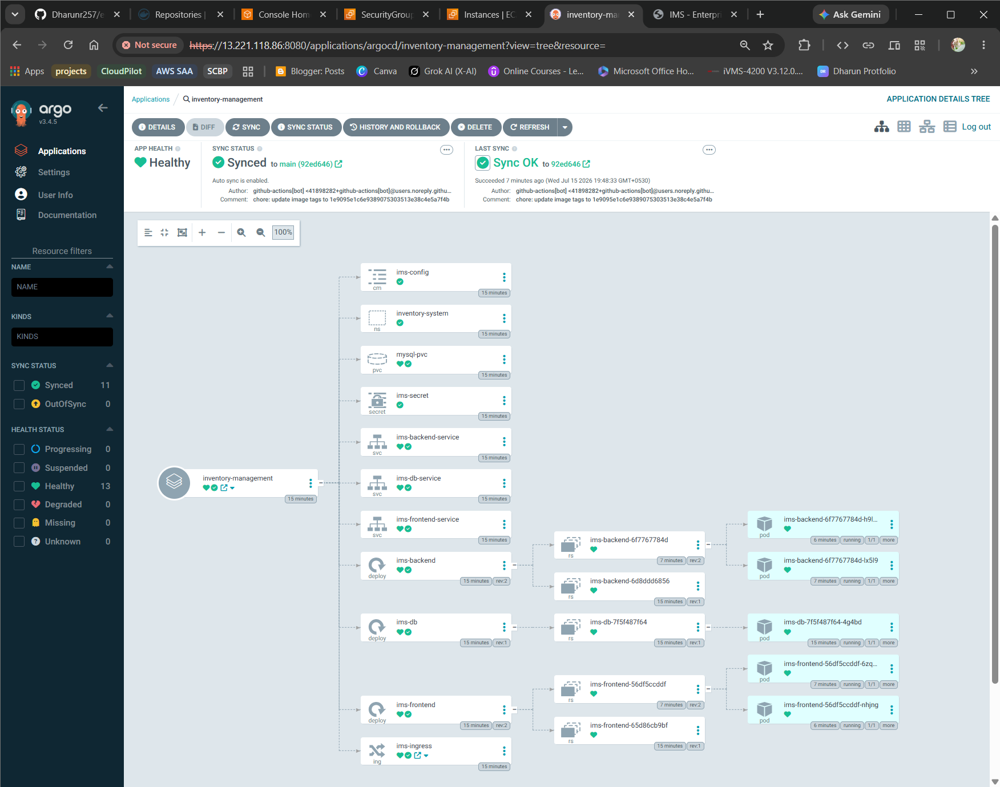
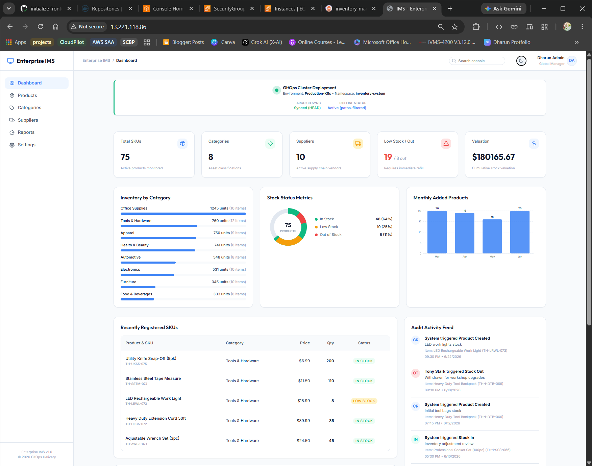
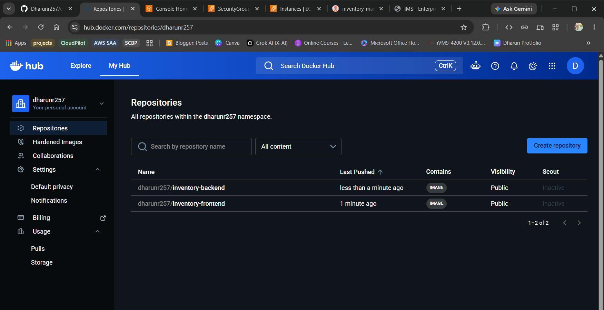
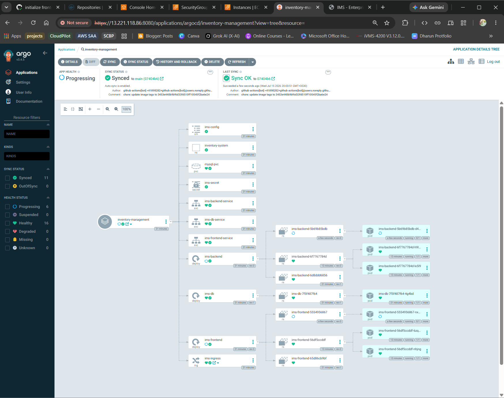
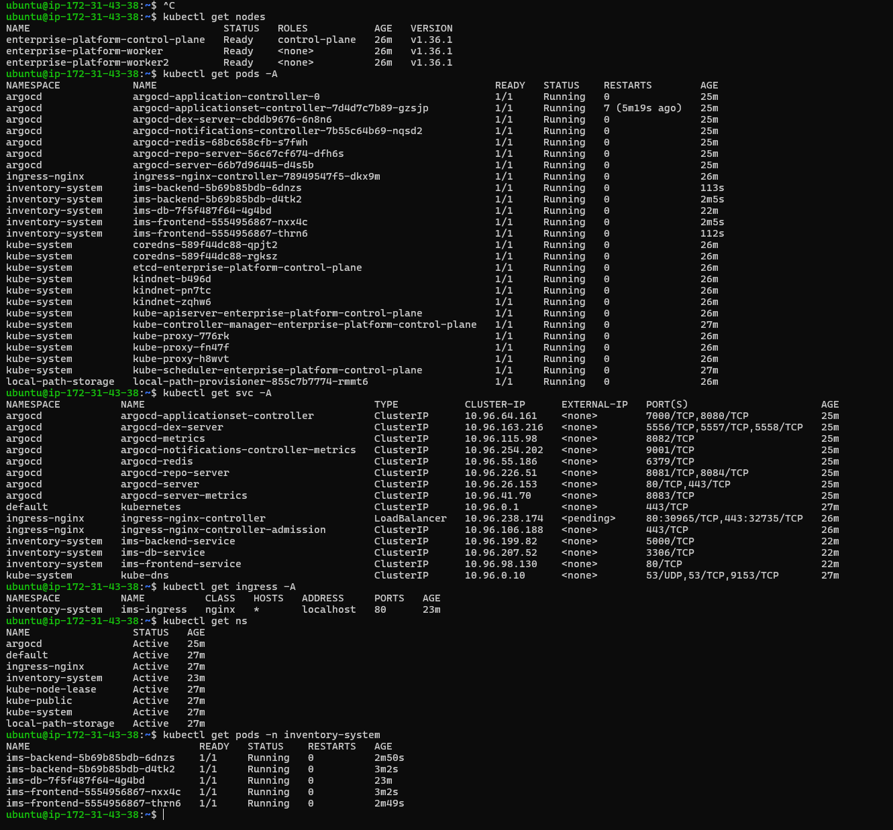
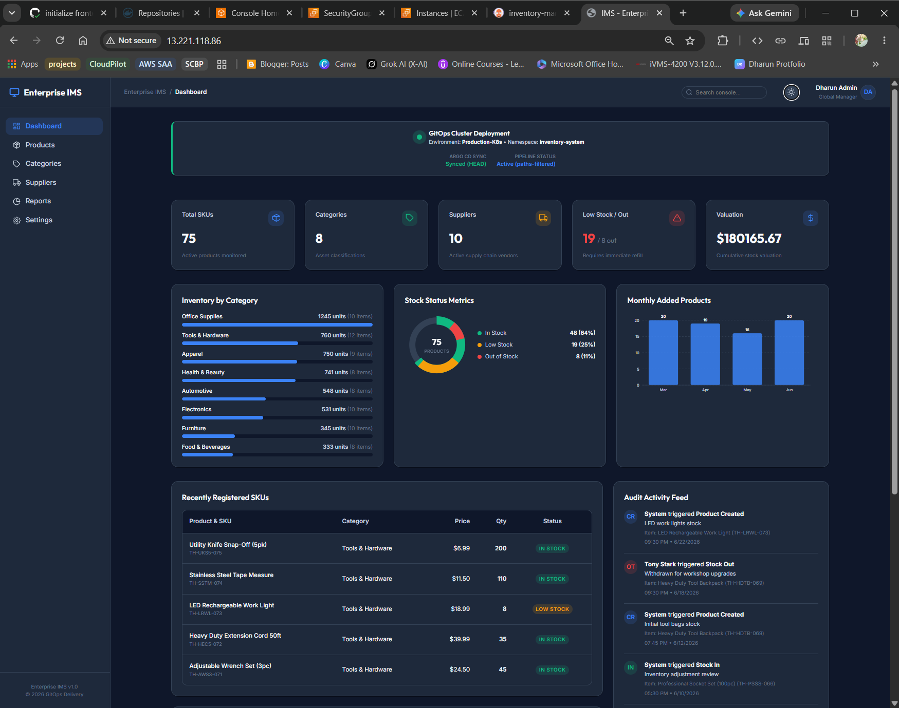

# 🚀 Enterprise GitOps Kubernetes Application Delivery Platform

<p align="center">


</p>

A production-inspired **GitOps application delivery platform** demonstrating modern Kubernetes deployment practices using **GitHub Actions**, **Docker**, **Argo CD**, and **Kubernetes (Kind)**.

The project implements a complete GitOps workflow where Git serves as the **single source of truth**. Every application change automatically flows through a CI pipeline, updates Kubernetes manifests, and is continuously synchronized to the Kubernetes cluster by Argo CD.

---

# 📸 Project Preview



---

# 📖 Project Overview

This project demonstrates an enterprise-inspired GitOps deployment workflow for containerized applications.

Instead of deploying directly to Kubernetes from a CI pipeline, the deployment process follows GitOps principles:

- Developers push application code to GitHub.
- GitHub Actions builds Docker images.
- Images are pushed to Docker Hub.
- Kubernetes deployment manifests are automatically updated.
- Updated manifests are committed back to Git.
- Argo CD continuously watches the Git repository.
- Argo CD synchronizes the Kubernetes cluster to match the desired state stored in Git.

This approach improves deployment consistency, enables automatic reconciliation, and establishes Git as the single source of truth for Kubernetes deployments.

---

# ✨ Features

## Continuous Integration (CI)

- GitHub Actions workflow automation
- Automated frontend Docker image build
- Automated backend Docker image build
- Docker Hub image publishing
- Automatic Kubernetes manifest updates
- Immutable image versioning using Git commit SHA
- Automatic manifest commit back to GitHub

---

## GitOps Continuous Deployment (CD)

- Argo CD deployment automation
- Automatic synchronization
- Self-healing Kubernetes resources
- Automatic pruning
- Git as the single source of truth
- Declarative Kubernetes deployments

---

## Kubernetes Platform

- Multi-node Kind Kubernetes cluster
- NGINX Ingress Controller
- Namespace isolation
- Rolling application updates
- Kubernetes Deployments
- Services
- Persistent Volume Claims
- MySQL database deployment

---

## Sample Application

Inventory Management System

- React Frontend
- Node.js + Express Backend
- MySQL Database
- REST API
- Persistent storage
- Responsive dashboard

---

# 🏗️ Solution Architecture

```text
                        Developer
                             │
                             ▼
                     GitHub Repository
                             │
                    Git Push (Source Code)
                             │
                             ▼
                     GitHub Actions (CI)
                             │
         ┌───────────────────┴────────────────────┐
         │                                        │
 Build Frontend Image                    Build Backend Image
         │                                        │
         └───────────────────┬────────────────────┘
                             │
                             ▼
                         Docker Hub
                             │
              Update Kubernetes Manifests
                             │
                             ▼
                     GitHub Repository
                             │
                             ▼
                          Argo CD
                             │
                     Automatic Synchronization
                             │
                             ▼
                  Kind Kubernetes Cluster
                             │
      ┌───────────────┬───────────────┬
      ▼               ▼               ▼
 Frontend        Backend          MySQL Database
 Deployment      Deployment        Deployment
      │               │               │
      └───────────────┴───────────────┘
                      │
                      ▼
                 NGINX Ingress
                      │
                      ▼
                  Web Browser
```

---

# 📸 CI/CD Workflow



The GitHub Actions pipeline automates the Continuous Integration process by:

1. Checking out the repository.
2. Logging into Docker Hub.
3. Building frontend and backend Docker images.
4. Publishing images to Docker Hub.
5. Updating Kubernetes deployment manifests.
6. Committing updated manifests back to GitHub.

---

# 🛠️ Technology Stack

| Category | Technologies |
|-----------|--------------|
| Cloud Platform | AWS EC2 |
| Container Runtime | Docker |
| Container Registry | Docker Hub |
| Container Orchestration | Kubernetes (Kind) |
| GitOps | Argo CD |
| CI Platform | GitHub Actions |
| Frontend | React |
| Backend | Node.js, Express |
| Database | MySQL |
| Ingress | NGINX Ingress Controller |
| Version Control | Git & GitHub |
| Operating System | Ubuntu 24.04 LTS |

---


# 📂 Repository Structure

```text
enterprise-gitops-kubernetes-platform/
│
├── .github/
│   └── workflows/
│       └── ci-cd.yml
│
├── frontend/
│
├── backend/
│
├── k8s/
│   ├── namespace.yaml
│   ├── deployment-frontend.yaml
│   ├── deployment-backend.yaml
│   ├── deployment-db.yaml
│   ├── service-frontend.yaml
│   ├── service-backend.yaml
│   ├── service-db.yaml
│   ├── pvc-db.yaml
│   └── ingress.yaml
│
├── Dockerfile.frontend
├── Dockerfile.backend
│
├── README.md
│
└── screenshots/
```

---

# ⚙️ Continuous Integration Workflow

GitHub Actions is responsible for the Continuous Integration (CI) process.

Every push to the **main** branch automatically triggers the pipeline.

## CI Pipeline Flow

```text
Developer
      │
      ▼
Push Code to GitHub
      │
      ▼
GitHub Actions
      │
      ├── Checkout Repository
      ├── Login to Docker Hub
      ├── Build Frontend Image
      ├── Build Backend Image
      ├── Push Frontend Image
      ├── Push Backend Image
      ├── Update Kubernetes Image Tags
      ├── Commit Updated Manifests
      └── Push Commit to Repository
```

---

## 📸 GitHub Actions Workflow



---

## CI Pipeline Responsibilities

The GitHub Actions workflow performs the following tasks automatically:

| Step | Description |
|-------|-------------|
| Checkout Repository | Downloads the latest source code |
| Docker Hub Login | Authenticates using GitHub Secrets |
| Build Frontend Image | Builds the React application image |
| Build Backend Image | Builds the Node.js API image |
| Push Images | Publishes images to Docker Hub |
| Update Deployment Files | Replaces image tags with the latest commit SHA |
| Commit Changes | Commits updated Kubernetes manifests |
| Push Back to GitHub | Triggers the GitOps deployment process |

---

# 🚀 GitOps Deployment Workflow

Unlike traditional CI/CD pipelines that deploy directly to Kubernetes, this project follows the GitOps model.

Argo CD continuously watches the Git repository and ensures the Kubernetes cluster always matches the desired state defined in Git.

## GitOps Deployment Flow

```text
GitHub Repository
        │
        ▼
Argo CD
        │
Repository Monitoring
        │
        ▼
Manifest Change Detected
        │
        ▼
Automatic Synchronization
        │
        ▼
Apply Kubernetes Resources
        │
        ▼
Rolling Update
        │
        ▼
Healthy Application
```

---

## 📸 Argo CD Dashboard



---

## Benefits of GitOps

- Git serves as the single source of truth.
- Declarative infrastructure management.
- Automatic deployment synchronization.
- Automatic self-healing.
- Automatic pruning of deleted resources.
- Complete deployment history stored in Git.
- Reduced manual operational tasks.

---

# ☸️ Kubernetes Deployment

The application is deployed to a **multi-node Kind Kubernetes cluster**.

The cluster consists of:

- 1 Control Plane Node
- 2 Worker Nodes

The application is exposed externally through the **NGINX Ingress Controller**.

---

## Kubernetes Resources

| Resource | Purpose |
|----------|---------|
| Namespace | Isolates project resources |
| Deployments | Manages application Pods |
| Services | Internal networking |
| Persistent Volume Claim | MySQL persistent storage |
| Ingress | External HTTP access |
| ReplicaSets | Maintains desired Pod count |

---

## 📸 Kubernetes Cluster

> Replace with your Kubernetes screenshot.


---

## Resource Deployment

```text
inventory-system
│
├── Frontend Deployment
│      ├── ReplicaSet
│      └── Pods
│
├── Backend Deployment
│      ├── ReplicaSet
│      └── Pods
│
├── MySQL Deployment
│      └── Persistent Volume
│
├── ClusterIP Services
│
└── NGINX Ingress
```

---

# 🌐 Application Request Flow

The application follows a standard Kubernetes networking model.

```text
Browser
    │
    ▼
NGINX Ingress
    │
    ▼
Frontend Service
    │
    ▼
Frontend Pods
    │
    ▼
Backend Service
    │
    ▼
Backend Pods
    │
    ▼
MySQL Service
    │
    ▼
MySQL Database
```

---

## 📸 Running Application



---

# 📦 Docker Images

Two container images are automatically built during every successful pipeline execution.

- Frontend Image
- Backend Image

Each image is published with:

- `latest`
- Immutable Git Commit SHA tag

This ensures deployments are traceable and reproducible.

---

## 📸 Docker Hub Repository



---

# 🚀 Deployment Guide

This section provides an overview of how the GitOps platform is deployed.

## Prerequisites

Before deploying the project, ensure the following tools are installed:

| Tool | Purpose |
|------|---------|
| Git | Version Control |
| Docker | Container Runtime |
| Kubernetes (Kind) | Local Kubernetes Cluster |
| kubectl | Kubernetes CLI |
| GitHub Account | Source Code Repository |
| Docker Hub Account | Container Registry |
| Argo CD | GitOps Continuous Deployment |

---

# 📋 Deployment Workflow

The platform is deployed in the following order:

```text
Launch EC2 Instance
        │
        ▼
Install Docker
        │
        ▼
Create Multi-Node Kind Cluster
        │
        ▼
Install NGINX Ingress Controller
        │
        ▼
Install Argo CD
        │
        ▼
Configure GitHub Actions
        │
        ▼
Push Source Code
        │
        ▼
GitHub Actions Builds Images
        │
        ▼
Docker Hub
        │
        ▼
Argo CD Sync
        │
        ▼
Application Running on Kubernetes
```

---

# 🔐 GitHub Secrets

The CI pipeline uses GitHub Secrets to securely authenticate with Docker Hub.

| Secret | Description |
|---------|-------------|
| `DOCKERHUB_USERNAME` | Docker Hub Username |
| `DOCKERHUB_TOKEN` | Docker Hub Access Token |

These secrets are referenced within the GitHub Actions workflow and are never stored directly in the repository.

---

# ⚙️ GitHub Actions Pipeline

The CI workflow is automatically triggered whenever code is pushed to the `main` branch.

Pipeline stages include:

- Checkout Repository
- Authenticate with Docker Hub
- Build Frontend Docker Image
- Build Backend Docker Image
- Push Images to Docker Hub
- Update Kubernetes Deployment Manifests
- Commit Updated Image Tags
- Push Changes Back to GitHub

---

# 🔄 Argo CD Continuous Deployment

Argo CD continuously monitors the Git repository for manifest changes.

Whenever the deployment manifests are updated, Argo CD automatically:

- Detects the new commit
- Compares desired state with cluster state
- Synchronizes Kubernetes resources
- Performs rolling updates
- Maintains cluster consistency

No manual deployment commands are required after the initial setup.

---

# 📸 Argo CD Synchronization



---

# ☸️ Kubernetes Resources

The project deploys the following Kubernetes resources.

| Resource | Name |
|----------|------|
| Namespace | inventory-system |
| Frontend Deployment | ims-frontend |
| Backend Deployment | ims-backend |
| MySQL Deployment | ims-db |
| Frontend Service | ims-frontend-service |
| Backend Service | ims-backend-service |
| MySQL Service | ims-db-service |
| Persistent Volume Claim | mysql-pvc |
| Ingress | ims-ingress |

---

# 📸 Kubernetes Resources



---

# 🌐 Application Access

Once the platform has been successfully deployed, the Inventory Management System can be accessed through the NGINX Ingress Controller.

```text
http://<EC2_PUBLIC_IP>
```

The request flow is:

```text
Internet
     │
     ▼
NGINX Ingress
     │
     ▼
Frontend Service
     │
     ▼
Frontend Pods
     │
     ▼
Backend Service
     │
     ▼
Backend Pods
     │
     ▼
MySQL Database
```

---

# 📸 Inventory Management System



---

# ✅ Project Validation

The platform was validated through several deployment scenarios.

### GitHub Actions Validation

- Successfully built frontend and backend Docker images.
- Successfully pushed images to Docker Hub.
- Successfully updated Kubernetes manifests.
- Successfully committed manifest changes back to GitHub.

---

### Argo CD Validation

- Successfully detected Git commits.
- Automatically synchronized Kubernetes resources.
- Maintained Healthy application status.
- Successfully performed rolling updates.

---

### Kubernetes Validation

- Multi-node Kind cluster deployed successfully.
- Frontend and backend Pods distributed across worker nodes.
- MySQL persistent storage functioning correctly.
- NGINX Ingress routing verified.

---

### Application Validation

- Frontend accessible through Ingress.
- Backend REST APIs responding successfully.
- Database connectivity verified.
- CRUD operations functioning correctly.

---

# 🎯 Skills Demonstrated

## Cloud

- AWS EC2
- Linux Administration

## Containers

- Docker
- Docker Hub

## Kubernetes

- Multi-node Kind Cluster
- Deployments
- Services
- Ingress
- Persistent Volumes
- Namespace Management

## GitOps

- Argo CD
- Automatic Synchronization
- Self-Healing
- Declarative Deployments

## CI/CD

- GitHub Actions
- Automated Container Builds
- Manifest Automation
- Immutable Image Versioning

## Application Development

- React
- Node.js
- Express
- MySQL

---

# 🔍 Challenges and Solutions

During the development of this project, several real-world challenges were encountered and resolved.

| Challenge | Solution |
|----------|----------|
| Frontend pods entered `CrashLoopBackOff` due to incorrect backend service name | Updated the NGINX configuration to use the correct Kubernetes service name (`ims-backend-service`). |
| Application was inaccessible through the EC2 public IP | Configured the NGINX Ingress Controller correctly for a multi-node Kind cluster and ensured traffic was routed through the control-plane node. |
| Docker images were not automatically deployed | Implemented a GitHub Actions workflow to update Kubernetes deployment manifests with the latest image tags. |
| Kubernetes deployments used outdated image versions | Adopted immutable image tagging using the Git commit SHA for traceable deployments. |
| Manual Kubernetes deployments created configuration drift | Implemented Argo CD to continuously synchronize the cluster with the Git repository, making Git the single source of truth. |

---

# 💡 Key Learning Outcomes

This project provided hands-on experience with modern cloud-native application delivery and GitOps practices.

Key takeaways include:

- Designing and implementing a complete GitOps workflow.
- Building an automated CI pipeline using GitHub Actions.
- Creating and publishing Docker images automatically.
- Managing Kubernetes deployments declaratively.
- Deploying applications to a multi-node Kubernetes cluster.
- Configuring the NGINX Ingress Controller for external access.
- Automating Kubernetes deployments using Argo CD.
- Understanding the importance of Git as the single source of truth.
- Working with immutable container image versioning.
- Troubleshooting Kubernetes networking, services, and ingress configurations.

---

# 📈 Project Highlights

- ✅ Fully automated CI pipeline using GitHub Actions
- ✅ GitOps-based Continuous Deployment using Argo CD
- ✅ Multi-node Kubernetes cluster with Kind
- ✅ React + Node.js + MySQL sample application
- ✅ Dockerized frontend and backend services
- ✅ Automatic image versioning with Git commit SHA
- ✅ Automatic Kubernetes manifest updates
- ✅ Automatic synchronization with Argo CD
- ✅ Declarative Kubernetes resource management
- ✅ External application access using NGINX Ingress

---

# 🚀 Future Enhancements

Possible improvements for future iterations of this project include:

- Migrate the platform from Kind to Amazon EKS.
- Replace Docker Hub with Amazon ECR.
- Introduce Helm charts for Kubernetes deployments.
- Add Horizontal Pod Autoscaler (HPA).
- Configure TLS using cert-manager and Let's Encrypt.
- Implement GitOps using a dedicated manifests repository.
- Add automated rollback strategies.
- Integrate Kubernetes admission policies.
- Add deployment notifications (Slack or Microsoft Teams).
- Support multiple environments (Development, Staging, Production).

---

# 🧠 Skills Demonstrated

### Cloud & Infrastructure

- AWS EC2
- Linux Administration
- Containerized Application Deployment

### Containers

- Docker
- Docker Hub

### Kubernetes

- Multi-node Kind Cluster
- Deployments
- Services
- Ingress
- Persistent Volume Claims
- Namespaces
- Rolling Updates

### GitOps

- Argo CD
- Automatic Synchronization
- Self-Healing
- Declarative Infrastructure
- Git as the Single Source of Truth

### CI/CD

- GitHub Actions
- Automated Docker Builds
- Automated Manifest Updates
- Immutable Image Versioning

### Application Development

- React
- Node.js
- Express
- MySQL

---

# 📚 References

- Kubernetes Documentation
- Argo CD Documentation
- GitHub Actions Documentation
- Docker Documentation
- Kind Documentation
- NGINX Ingress Controller Documentation

---

# 👨‍💻 Author

**Dharun R**
**Enterprise Kubernetes Observability Platform**

---
